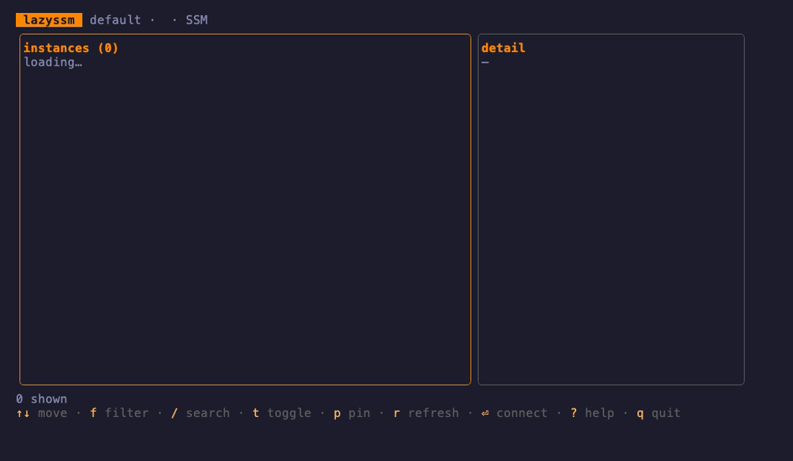

# lazyssm

A persistent-panel terminal UI for **AWS SSM Session Manager** — browse your
SSM-connectable instances, scope them with server-side tag/name filters, pin
favorites, and open a shell in one keypress.

Think [lazyssh](https://github.com/adembc/lazyssh) / lazydocker / k9s, but
backed by AWS SSM instead of `~/.ssh/config`. No bastion host, no open port
22 — every session goes through Session Manager.

[](https://github.com/chalvinwz/lazyssm/actions/workflows/ci.yml)
[](https://go.dev/dl/)
[](LICENSE)
[](CONTRIBUTING.md)



---

## Why

Existing SSM tooling is either one-shot fzf-style pickers (gossm, aws-gate)
that drop you back to the shell after each connection, or broad AWS dashboards
where SSM is one feature among many. lazyssm is the focused, persistent panel
for the one task you repeat all day: find the instance and connect.

---

## Features

- **Persistent panel TUI** — the instance list stays open between sessions; no
  re-invoking a picker on every connect.
- **Merged inventory** — SSM `DescribeInstanceInformation` is joined with EC2
  `DescribeInstances` so you see Name tags, IPs, and instance state alongside
  SSM agent status.
- **Server-side tag/name filter** — pushes `tag:K=V` and Name-prefix constraints
  to the EC2/SSM APIs so the filter scales to large fleets without pulling
  everything locally.
- **Client-side fuzzy search** — live Name-based fuzzy filter over the already-
  fetched set; navigate results with arrow keys while typing.
- **Toggle source** — switch between SSM-managed nodes only (default) and all
  EC2 instances; non-SSM instances are shown as not-ready.
- **Pin favorites** — pinned instance IDs are persisted as YAML locally and
  float to the top of the list on every launch.
- **One-key connect** — `Enter` hands the terminal to `aws ssm start-session`;
  the TUI resumes when the session ends.
- **`doctor` subcommand** — preflight checks for the aws CLI, the
  session-manager-plugin, region resolution, credentials, and SSO session
  validity.

---

## Prerequisites

lazyssm shells out to the AWS CLI and the Session Manager plugin. It does not
reimplement the SSM protocol. Both must be installed and on your `PATH` before
you can open sessions.

### AWS CLI v2

- Docs: https://docs.aws.amazon.com/cli/latest/userguide/getting-started-install.html
- macOS: `brew install awscli`

### session-manager-plugin

- Docs: https://docs.aws.amazon.com/systems-manager/latest/userguide/session-manager-working-with-install-plugin.html
- macOS: `brew install --cask session-manager-plugin`

Verify both are present and your credentials are valid:

```sh
lazyssm doctor
```

---

## Install

### go install (recommended)

Requires Go 1.26.3 or later.

```sh
go install github.com/chalvinwz/lazyssm/cmd/lazyssm@latest
```

### Build from source

```sh
git clone https://github.com/chalvinwz/lazyssm
cd lazyssm
make build          # produces bin/lazyssm
# or
make install        # installs into GOBIN via go install
```

---

## Usage

```sh
# Launch the TUI with the default AWS profile and region
lazyssm

# Explicit profile and region
lazyssm --profile prod --region eu-west-1

# Re-run `aws sso login` automatically when the SSO session expires
lazyssm --profile prod --auto-login

# Run environment preflight checks
lazyssm doctor
lazyssm --profile staging doctor

# Print the build version
lazyssm --version
```

### Flags

| Flag           | Default           | Description                                              |
| -------------- | ----------------- | -------------------------------------------------------- |
| `--profile`    | (AWS default)     | AWS profile; overrides `AWS_PROFILE`                     |
| `--region`     | (AWS default)     | AWS region; overrides `AWS_REGION`                       |
| `--auto-login` | off               | Run `aws sso login` automatically on SSO session expiry  |
| `--version`    | —                 | Print version string and exit                            |

### Making a profile permanent

```sh
export AWS_PROFILE=prod
lazyssm
```

Any profile set via the environment is picked up automatically; `--profile`
takes precedence over `AWS_PROFILE` when both are set.

---

## Filtering and Search

lazyssm has two independent narrowing mechanisms.

### Server-side filter (`f`)

Press `f` to open the filter bar. Tokens are sent to the EC2/SSM APIs —
nothing is downloaded that does not match.

| Token syntax       | Effect                                         |
| ------------------ | ---------------------------------------------- |
| `tag:Key=Value`    | Require an EC2 tag with that exact key/value   |
| `name:prefix`      | Require the Name tag to start with `prefix`    |
| `prefix` (bare)    | Shorthand for a Name prefix (last token wins)  |

Multiple tokens are combined with AND semantics. Examples:

```
tag:Env=prod
tag:Env=prod web-
tag:Env=prod tag:Team=platform name:api-
```

Press `Enter` to apply, `Esc` to cancel. Tokens that can't be parsed (for
example `tag:Key` with no `=value`) are reported in the status line and skipped
rather than silently dropped.

### Client-side fuzzy search (`/`)

Press `/` to open the search bar. lazyssm runs a fuzzy match against each
instance's **Name tag** (falling back to the instance ID when no Name is set)
over the already-fetched set — no extra API calls. While the search bar is
focused you can navigate the narrowed results live with `↑`/`↓` (or
`Ctrl-N`/`Ctrl-P`); press `Enter` to connect to the highlighted instance, or
`Esc` to clear the search and return to the full list.

---

## Keybindings

| Key              | Action                                       |
| ---------------- | -------------------------------------------- |
| `↑` / `k`        | Move up                                      |
| `↓` / `j`        | Move down                                    |
| `g` / `Home`     | Jump to top                                  |
| `G` / `End`      | Jump to bottom                               |
| `f`              | Open server-side tag/name filter bar         |
| `/`              | Open client-side fuzzy search bar            |
| `t`              | Toggle SSM-only source ↔ all EC2             |
| `p`              | Pin / unpin selected instance                |
| `r`              | Refresh inventory from AWS                   |
| `Enter`          | Connect to selected instance (SSM shell)     |
| `?`              | Toggle keybinding help overlay               |
| `q` / `Ctrl+C`   | Quit                                         |

---

## Configuration

### Pinned instances (local store)

Pins are persisted as YAML at:

| OS      | Path                                              |
| ------- | ------------------------------------------------- |
| macOS   | `~/Library/Application Support/lazyssm/config.yaml` |
| Linux   | `~/.config/lazyssm/config.yaml`                   |
| Windows | `%AppData%\lazyssm\config.yaml`                   |

The exact path is resolved by `os.UserConfigDir()` at runtime. The file is
created automatically on first pin; deleting it resets all pins.

Example file:

```yaml
pinned:
  - i-0a1b2c3d4e5f6a7b8
  - i-0deadbeefcafe1234
```

### Credential precedence

1. `--profile` / `--region` flags
2. `AWS_PROFILE` / `AWS_REGION` environment variables
3. AWS shared config (`~/.aws/config`, `~/.aws/credentials`)

SSO profiles are supported. If `lazyssm doctor` reports an expired SSO
session, refresh it with:

```sh
aws sso login --profile <profile>
```

### Automatic SSO login

With `--auto-login`, lazyssm handles the expired session itself: when the
startup credential check or an inventory refresh fails because the SSO session
is expired, the TUI suspends, hands the terminal to `aws sso login` (passing
your `--profile`/`--region`; with no `--profile`, the aws CLI honors
`AWS_PROFILE`), and resumes with a fresh fetch once the browser flow completes.

To enable it permanently, add it to the config file instead of the flag:

```yaml
# ~/.config/lazyssm/config.yaml (macOS: ~/Library/Application Support/lazyssm/config.yaml)
auto_login: true
```

One login attempt is made per expiry: if credentials still fail afterwards
(login cancelled, wrong profile), the preflight screen appears as usual instead
of looping. `lazyssm doctor` never auto-logins — it only reports.

---

## Required IAM Permissions

The IAM principal used by lazyssm needs:

```
ssm:DescribeInstanceInformation
ssm:StartSession
ec2:DescribeInstances
sts:GetCallerIdentity
```

`sts:GetCallerIdentity` is used only by the `doctor` preflight check and the
TUI startup credential verification. `ec2:DescribeInstances` powers the Name
tag merge, IP display, and the all-EC2 toggle; SSM-only browsing degrades
gracefully without it (names and tags will be absent). `ssm:StartSession` is
required on the target instance resource.

Minimal example policy:

```json
{
  "Version": "2012-10-17",
  "Statement": [
    {
      "Effect": "Allow",
      "Action": [
        "ssm:DescribeInstanceInformation",
        "ssm:StartSession",
        "ec2:DescribeInstances",
        "sts:GetCallerIdentity"
      ],
      "Resource": "*"
    }
  ]
}
```

---

## Development

### Make targets

```sh
make build       # compile to bin/lazyssm
make run         # go run ./cmd/lazyssm (no binary written)
make doctor      # go run ./cmd/lazyssm doctor
make test        # go test ./...
make cover       # go test -cover ./...
make vet         # go vet ./...
make fmt         # gofmt -w .
make fmt-check   # fail if any file is not gofmt-clean
make check       # fmt-check + vet + test (CI gate)
make release     # cross-compile all six platforms into bin/
make install     # go install into GOBIN
make clean       # remove bin/
make help        # list all targets with descriptions
```

### Cross-compile targets (`make release`)

`linux/amd64`, `linux/arm64`, `darwin/amd64`, `darwin/arm64`,
`windows/amd64`, `windows/arm64`.

Output files land in `bin/` as `lazyssm-<os>-<arch>[.exe]`.

### Running tests

```sh
make test
# or directly:
go test ./...
```

The test suite covers the filter parser (`internal/ui`), fuzzy search
behaviour (`internal/ui`), the TUI `Update` state machine (`internal/ui`),
inventory merge logic and context-deadline handling (`internal/inventory`),
preflight checks (`internal/preflight`), the pin store (`internal/store`), and
session argument construction (`internal/session`).

### CI

GitHub Actions runs on every push to `main` and every pull request:

- `test` — `gofmt` check, `go vet ./...`, `go test -race` with coverage; prints a
  coverage summary and uploads `coverage.out` as a build artifact
- `lint` — `golangci-lint`
- `govulncheck` — scans for reachable vulnerabilities in dependencies
- `build` matrix — `linux`, `darwin`, `windows` × `amd64`, `arm64`

The Go version is read from `go.mod` (`go-version-file`), so it stays in lockstep
with the toolchain — currently Go 1.26.3.

---

## Contributing

Contributions are welcome. See **[CONTRIBUTING.md](CONTRIBUTING.md)** for the
trunk-based workflow, branch naming, and release process.

1. Fork the repository and create a `prefix/kebab-summary` branch
   (e.g. `fix/...`, `feature/...`).
2. Run `make check` before opening a pull request — formatting, vet, and tests.
   CI also runs the race detector, `golangci-lint`, and `govulncheck`.
3. Keep new code covered by tests where practical.
4. Open a pull request against `main`; it will be squash-merged once CI is green.

New here? Look for issues labelled **`good first issue`** and **`help wanted`**.
To report a vulnerability, see **[SECURITY.md](SECURITY.md)** — do not open a
public issue.

---

## License

[MIT](LICENSE) — Copyright (c) 2026 chalvinwz
